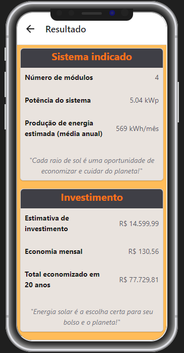

## Integrantes do Grupo

Gabriel de Souza Grego - Desenvolvedor Frontend 

Kayque Ferreira dos Santos - Desenvolvedor Backend

André Alves da Silva - Desenvolvedor Backend

## Descrição

O Solinveste é um aplicativo para realizar cálculos que ajudam os usuários a optar por
implementarem a energia solar em suas residências.

## Público-Alvo

O aplicativo é voltado para usuários que desejam começar a utilizar a energia solar em suas casas.

## Problemas que a Aplicação se Propõe a Resolver

O sistema irá receber dados da conta de energia do usuário, como o custo mensal e o consumo em kWh e,
através disso, realizará os cálculos necessários para fornecer estimativas sobre o quanto ele deve investir
para montar o sistema de energia solar ideal para seu imóvel, quando ele terá retorno sobre esse investimento
e os beneficios que ele trará ao meio ambiente por fazer esse investimento.

## Imagens da Aplicação

## Links

Link do PITCH - https://youtu.be/8vf6YciO0nc

Link do FIGMA - https://www.figma.com/design/GixD5ZUiPcFwo9TBc9auZM/FIAP---3%C2%BA-semestre?node-id=118-2&t=hKAYYQoX6LkjWIsV-1
